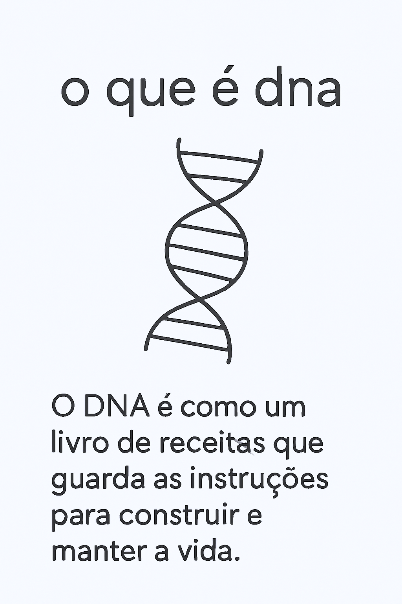

    
    
    

# 🤖 Analog.IA: Explicação Visual Minimalista de Conceitos ✨

Um sistema multiagente para transformar o aprendizado de conceitos complexos em cards visuais simples e memoráveis, utilizando analogias impactantes.

## ⚙️ Funcionamento:

* ### 🔍 Agente\_buscador:
    Recebe a pergunta sobre um conceito e busca informações confiáveis e detalhadas online.
    ➡️ **Saída:** Resumo detalhado e referenciado do conceito.

* ### 💡 Agente\_Resumo\_Analogia:
    Analisa a informação, cria um resumo conciso e desenvolve uma analogia visual simples e memorável.
    ➡️ **Saída:** Resumo do conceito e analogia visual (descrita textualmente) separados.

* ### 🎨 Agente\_Criador\_Card:
    Cria o texto para o card (título e explicação curta com a analogia) e descreve a ilustração minimalista (elementos simbólicos, linhas finas).
    ➡️ **Saída:** Conteúdo textual do card e descrição da ilustração.

* ### 🖼️ Agente\_Criador\_Prompt\_Imagem:
    Gera um prompt de texto formatado para a IA de imagem criar um card vertical minimalista com a analogia visual como foco, complementando o texto.
    ➡️ **Saída:** Prompt de texto para a IA de imagem.

## 🎯 Objetivo:

Simplificar o aprendizado de conceitos complexos através de cards visuais diretos e eficazes, utilizando analogias minimalistas.

## 🚀 Próximos Passos:

1.  **Copiar o Prompt:** O Agente\_Criador\_Prompt\_Imagem gerará um texto específico. Copie integralmente este texto.
2.  **Colar no Gerador de Imagem:** Cole o prompt copiado em uma ferramenta de geração de imagem de sua preferência.

## ❗ Importante: Geração da Imagem

O Analog.IA chega até a criação do prompt de imagem, pois a configuração de um agente para gerar imagens diretamente dentro do ambiente atual não foi implementada. O prompt gerado pelo Agente_Criador_Prompt_Imagem é o insumo para a criação visual do card.

